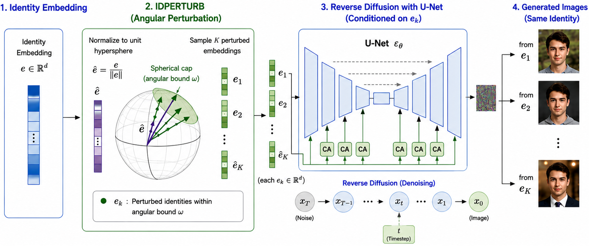

# IDPERTURB: Enhancing Variation in Synthetic Face Generation via Angular Perturbations




## Official implementation of the paper:

> **IDPERTURB: Enhancing Variation in Synthetic Face Generation via Angular Perturbations**  
> **Fadi Boutros, Eduarda Caldeira, Tahar Chettaoui, Naser Damer**


## Abstract

Synthetic face data has become an attractive alternative to authentic biometric datasets due to increasing privacy regulations and legal restrictions. Although recent identity-conditioned diffusion models can generate photorealistic and identity-consistent faces, they often suffer from limited intra-class variation, reducing their effectiveness for training robust face recognition models. **IDPERTURB** introduces a simple geometric sampling strategy that perturbs identity embeddings within a constrained angular region of the unit hypersphere. Instead of conditioning the diffusion model with a fixed identity embedding, multiple perturbed embeddings are generated and used for synthesis, producing diverse yet identity-coherent face images without modifying the underlying diffusion model.

## Installation

Clone the repository

```bash
git clone https://github.com/fdbtrs/IDPERTURB.git
cd IDPERTURB
```
The baseline pretrained LDMs are based on the code and pretrained models from [IDiffFace](https://github.com/fdbtrs/IDiff-Face) (FFHQ) and [UIFace](https://github.com/Tencent/TFace/tree/master/generation/uiface) (CASIA-WebFace)

The code works with PyTorch 1.10.0 and Python 3.8. 

To install dependencies:

```
pip install -r requirements.txt
```


## IDPerturb Sampling 
1. Pretrained diffusion weights and 10k synthetic identity embeddings can be from 
[UIFace](https://drive.google.com/drive/folders/11OnYj0mtEkepjl3gE2oLeDJu_WeuB0Ma?sjid=14928657911203604045-NC) for model trained on CASIA-WebFace and from [IDiff-Face](https://github.com/fdbtrs/IDiff-Face) for model trained on FFHQ.
2.  Download pre-trained decoder weights from [IDiff-Face](https://drive.google.com/drive/folders/1d-zs3yjsnzOMNkz7qy3JSb-fMf0UmSdT).
3. Adjust the path in the config files:  `configs/sample_ddim_config.yaml` and in  `configs/sample_ddim_config_unconditional.yaml` for uncondtional sampling.

```yaml
VQEncoder_path: <latent encoder path>
VQDncoder_path: <latent decoder path>
checkpoint:
    path: <diffusion checkpoint path>

sampling:
    contexts_file: <path of synthetic identity embeddings>
    save_dir: <where to save generated images>
```

 4. run 
```
torchrun --nnodes=1 --nproc_per_node 8 --master_port 12345 sample.py
```

## Citation

If you use IDPerturb or IDiff-Face, cite the following paper:

```
@InProceedings{Boutros_2026_CVPR,
    author    = {Boutros, Fadi and Caldeira, Eduarda and Chettaoui, Tahar and Damer, Naser},
    title     = {IDperturb: Enhancing Variation in Synthetic Face Generation via Angular Perturbations},
    booktitle = {Proceedings of the IEEE/CVF Conference on Computer Vision and Pattern Recognition (CVPR)},
    month     = {June},
    year      = {2026},
    pages     = {40119-40129}
}

@inproceedings{Boutros2023IDiffFace,
    author    = {Fadi Boutros and Jonas Henry Grebe  and Arjan Kuijper and Naser Damer},
    title     = {IDiff-Face: Synthetic-based Face Recognition through Fizzy Identity-conditioned Diffusion Models},
booktitle = {Proceedings of the IEEE/CVF International Conference on Computer Vision (ICCV)},
    month     = {October},
    year      = {2023}

}

```
## Reference repositories
- https://github.com/CompVis/latent-diffusion/
- https://github.com/fdbtrs/ElasticFace/
- https://github.com/fdbtrs/Unsupervised-Face-Recognition-using-Unlabeled-Synthetic-Data/
- https://github.com/Tencent/TFace/tree/master/generation/uifacehttps://github.com/Tencent/TFace/tree/master/generation/uiface
- https://github.com/fdbtrs/IDiff-Face

## License

```
This project is licensed under the terms of the Attribution-NonCommercial-ShareAlike 4.0 
International (CC BY-NC-SA 4.0) license. 
Copyright (c) 2026 Fraunhofer Institute for Computer Graphics Research IGD Darmstadt
```